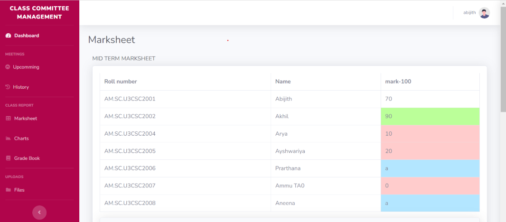
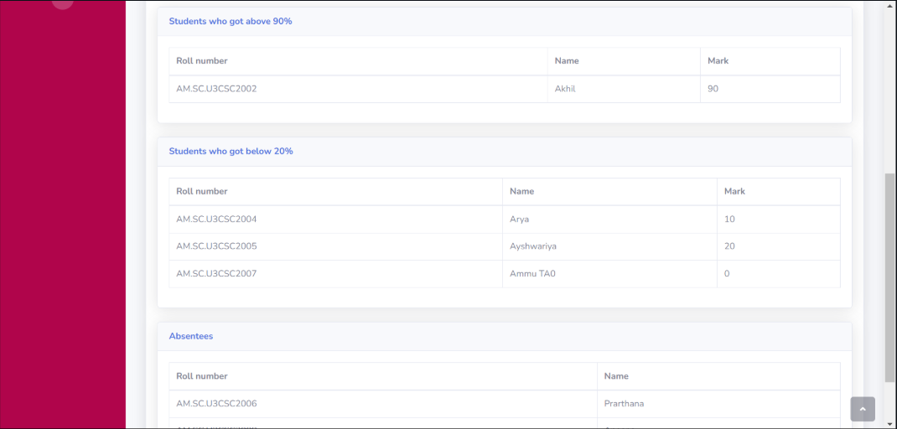

# 🧑‍🏫 Class Committee Management System (CCMS)

A web-based application developed to streamline class committee operations in college departments. It automates scheduling, attendance tracking, report submissions, and student performance evaluations, providing a centralized platform for HODs, Class Committee Chairs (CC-Chairs), Faculty, and Student Representatives.

---

## 📌 Table of Contents
- [📚 Introduction](#-introduction)
- [🚀 Features](#-features)
- [🧩 Problem Statement](#-problem-statement)
- [🧩 Modules](#-modules)
- [🧑‍💻 System Roles](#-system-roles)
- [🛠️ Technologies Used](#-technologies-used)
- [📐 Data Flow Diagrams](#-data-flow-diagrams)
- [🎯 Use Case Diagram](#-use-case-diagram)
- [🧭 Process Workflow](#-process-workflow)
- [📸 Screenshots](#-screenshots)
- [🖥️ Requirements](#-requirements)
- [🚀 Deployment](#-deployment)
- [📄 License](#-license)
- [🧠 Topics](#-topics)

---

## 📚 Introduction

The **Class Committee Management System (CCMS)** enables role-based management of class committee tasks, bringing transparency, efficiency, and automation into the academic workflow.

### 🗓️ Meeting Structure (Per Semester)
- **Zeroth Meeting** – Course plan & evaluation policy upload
- **First Meeting** – General Discussion
- **Midterm Meeting** – Submit Excel-based Midterm Marksheets
- **Internal Finalization** – Upload updated marks and reports
- **Grade Finalization** – Submit & generate final grade reports

🔔 Built-in features like **automated email reminders**, **file parsing**, **graphical analytics**, and **versioned uploads** help ensure timely and accurate academic operations.

---

## 🚀 Features

- ✅ Role-based Access Control (HOD, CC-Chair, Faculty, Student)
- ✅ Automated Email Reminders (12 hours before submission deadlines)
- ✅ Secure File Uploads (.xlsx, .pdf)
- ✅ Graph Generation from Excel Sheets (Min, Max, Avg, Outliers)
- ✅ Version Control for Files
- ✅ Live Meeting Tracking and History
- ✅ Class-wise and Course-wise Folder Management
- ✅ Real-time Document Status Checks by CC-Chair

---

## 🧩 Problem Statement

Managing academic documents and committee meetings across multiple batches can become tedious without a systematic approach. This project provides a centralized file structure (Department → Batch → Group → Course → Faculty → File) and a role-based workflow. It ensures:

- Timely submission of course documents
- Automated and manual file reminders
- Organized meeting scheduling and attendance tracking
- Generation of analytical reports from uploaded Excel mark sheets

---

## 🧩 Modules

| Module                | Description                                                |
|-----------------------|------------------------------------------------------------|
| 🏛️ HOD Dashboard      | Assign CC-Chairs, manage faculty and batches               |
| 🧑‍🏫 CC-Chair Panel    | Schedule meetings, send reminders, track uploads           |
| 👨‍🎓 Faculty Portal     | Upload course plans, marksheets, attendance reports        |
| 👩‍🎓 Student Panel     | View meeting minutes and performance summaries             |
| 📊 Graph Generator     | Convert Excel marksheets into analytical visuals           |
| 🗂️ File System         | Department → Batch → Group → Course → Files               |

---

## 🧑‍💻 System Roles

### 👤 HOD (Admin)
- Add Batches & Faculty
- Assign Class Committee Chairs
- View Meeting & Upload Reports

### 👩‍💼 Class Committee Chair
- Schedule Meetings
- Add Faculty & Student Representatives
- Send Reminders
- Track Submission Status

### 👨‍🏫 Faculty
- Upload Course Plans & Exam Results
- Submit Attendance & Grade Sheets
- Participate in Meetings

### 👩‍🎓 Student Representative
- Attend Meetings
- View Approved Reports (with permission)

---

## 🛠️ Technologies Used

| Category        | Tech Stack             |
|-----------------|------------------------|
| Frontend        | HTML, CSS, JavaScript  |
| Backend         | PHP                    |
| Database        | MySQL                  |
| File Processing | PHPExcel (.xlsx)       |
| Tools           | XAMPP, GitHub          |
| Hosting         | Localhost / Web Server |

---

## 📐 Data Flow Diagrams

### 🔁 Level 0 – Overview DFD  

### 🔄 Level 1 – Detailed Process Flow  

---

## 🎯 Use Case Diagram

Defines interactions between roles and system functionalities.

| Role                   | Key Actions                              |
|------------------------|-------------------------------------------|
| **HOD**                | Login, Assign Chair                       |
| **CC-Chair**           | Add Members, Schedule Meeting, Send Reminders |
| **Faculty**            | Upload Documents, Attend Meeting          |
| **Student Representative** | Attend Meeting                        |

---

## 🧭 Process Workflow

A step-by-step visual guide to understand how meetings and document flows are handled in the system.

---

## 📸 Screenshots

### 🎓 Student Portal Interface  

### 📊 Graphical Mark Report  

### 📝 Grade Sheet Examples  
  
  

---

## 🖥️ Requirements

### 🧪 Software:
- PHP ≥ 7.x
- MySQL
- Web server: XAMPP / Apache
- Modern browser: Chrome, Firefox

### 🖱️ Hardware:
- Multi-core processor for efficient execution
- Stable internet connection (for hosted version)

---

## 🚀 Deployment

1. Clone the repository or download as ZIP  
2. Extract to the `htdocs` directory (XAMPP)  
3. Import the `classcommitteedb.sql` file in phpMyAdmin  
4. Start Apache & MySQL  
5. Visit: `http://localhost/Class-Committee-Management-System/`

---

## 📄 License

This project is licensed under the **Apache-2.0 License**.  
See the [LICENSE](./LICENSE) file for more information.

---

## 🧠 Topics

`php` `web-development` `front-end-development` `back-end-development`  
`student-portal` `bca-major-project` `minor-project` `management-system` `ccms`

---
**This system was developed as part of a group BCA Major Project (2023–24).**
---

> ⭐ If you found this project helpful or inspiring, please give it a **star** and follow our GitHub profiles!
